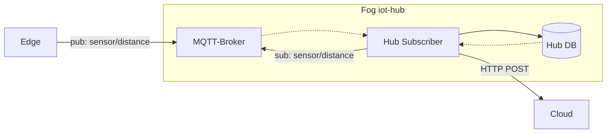

# iot-hub

IoT hub for collecting, storing and sending data to cloud.
Goal is to make it easy to setup and use.

TODO:
- [x] Store data on postgresql
- [x] Check so it works with pico-w but i cba because mqtt with lwip is dogshit
- [ ] Create working healthchecks
- [ ] Auth for mqtt broker
- [x] HTTP requests to cloud

## Start hub
```
./docker.sh
```

## Cleanup
```
./clean.sh
```

## PSQL in DB
```
./exec_db.sh
```


